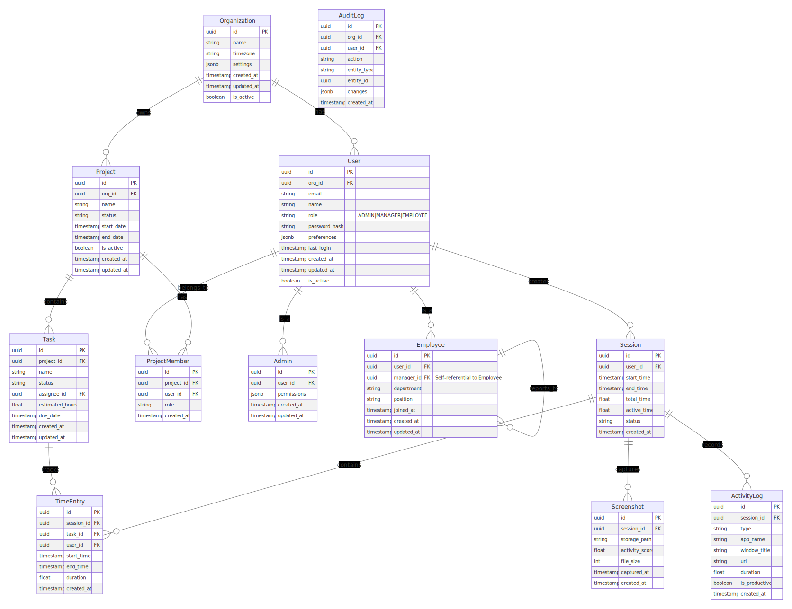

# treko-server

## Basic ERD

# Project Setup Commands

This project uses **Poetry** for dependency management and a **Makefile** to simplify common Django commands.

## Prerequisites

* Python 3.10+
* [Poetry](https://python-poetry.org/)

## Makefile Commands

### Installation & Setup

| Command        | Description                                                |
| -------------- | ---------------------------------------------------------- |
| `make install` | Install dependencies with Poetry                           |
| `make init`    | Initialize project (runs migrations and creates superuser) |

### Database Management

| Command                | Description                               |
| ---------------------- | ----------------------------------------- |
| `make migrate`         | Apply all Django migrations               |
| `make makemigrations`  | Create new migrations for modified models |
| `make createsuperuser` | Create a Django superuser                 |

### Development Server

| Command          | Description                                                                 |
| ---------------- | --------------------------------------------------------------------------- |
| `make runserver` | Start Django development server on port 8000 (change in Makefile if needed) |

### Testing

| Command     | Description                                                |
| ----------- | ---------------------------------------------------------- |
| `make test` | Run tests with coverage report (HTML output in `htmlcov/`) |

### Interactive Shell

| Command      | Description                            |
| ------------ | -------------------------------------- |
| `make shell` | Start Django shell (`manage.py shell`) |

### Code Quality

| Command       | Description                                              |
| ------------- | -------------------------------------------------------- |
| `make lint`   | Run linter (`flake8`)                                    |
| `make format` | Run code formatter (`black`) and import sorter (`isort`) |

### Cleanup

| Command      | Description                                                                            |
| ------------ | -------------------------------------------------------------------------------------- |
| `make clean` | Remove temporary files (`__pycache__`, `.pyc`, `.pyo`, coverage reports, pytest cache) |

